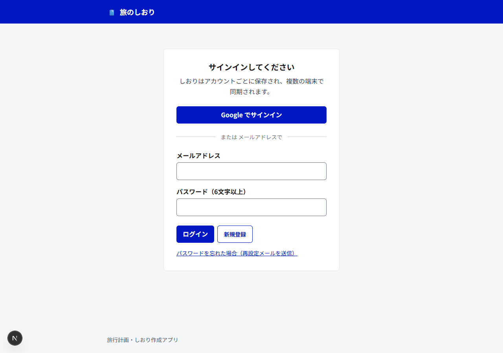
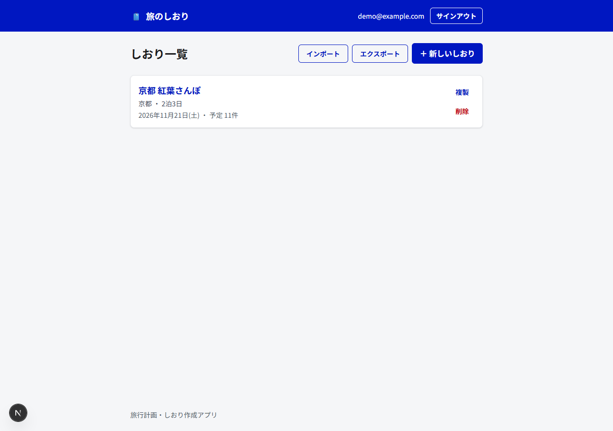
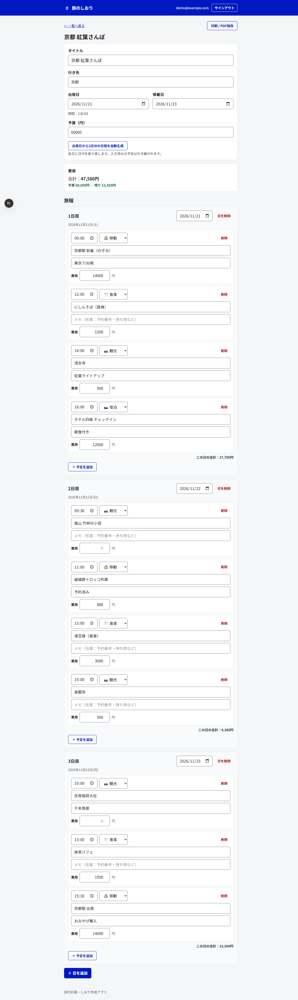
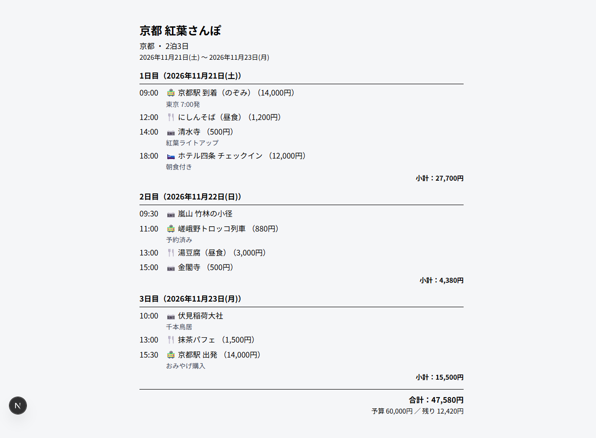

# 旅のしおり 🧳

旅行の計画を立て、日程・予定・費用をまとめた「しおり」を作成・共有できる Web アプリです。
行き先や日程、各日の予定（時刻・種別・費用）を登録し、予算管理や印刷／PDF 出力、
データのエクスポート／インポートまで行えます。データは **Firebase（Firestore）** に保存され、
**サインインしたアカウントごと**に複数の端末で同期されます。

## スクリーンショット

| サインイン | しおり一覧 |
| :---: | :---: |
|  |  |
| **しおり詳細（旅程・費用の編集）** | **印刷 / PDF 出力ビュー** |
|  |  |

> スクリーンショットはサンプルデータ「京都 紅葉さんぽ（2泊3日）」での表示例です。

## 主な機能

- **アカウント認証**：Google サインイン／メール＋パスワードの両方に対応。パスワード再設定メールも送信可能
- **しおりの管理**：作成・編集・複製・削除。一覧から各しおりへ移動
- **旅程（日程）の編集**：日ごとに予定（スポット）を追加。各予定に「時刻・種別（観光／食事／移動／宿泊／その他）・内容・メモ・費用」を登録
- **日程の自動生成**：出発日・帰着日から「○日目」を一括生成し、各日に日付を自動割り当て（入力済みの予定は維持）
- **時刻順の並べ替え**：各日の予定をワンタップで時刻順に整列（時刻未入力は末尾）
- **費用・予算管理**：予定ごとの費用を集計し、日ごと・旅行全体の合計を表示。予算に対する残額／超過を色分け表示
- **印刷 / PDF 出力**：編集用 UI を除いた読み取り専用レイアウトで、しおりを綺麗に印刷・PDF 保存
- **エクスポート / インポート**：全しおりを JSON で書き出し／読み込み。バックアップや端末間の移行に利用（インポートは ID を振り直す非破壊マージ）
- **クラウド同期**：Firestore に保存し、サインインすれば複数端末で同じデータを参照
- **アクセシビリティ**：デジタル庁デザインシステムに準拠（ラベル紐付け、コントラスト、フォーカスリング、Noto Sans JP）

## 技術スタック

- **Next.js 16**（App Router）/ **React 19** / **TypeScript**
- **Tailwind CSS 4**
- **Firebase**（Authentication / Cloud Firestore）
- **Vitest**（ユニットテスト）
- CI：GitHub Actions（Lint / 型チェック / テスト / ビルド）、Dependabot

## セットアップ

### 1. 依存関係のインストール

```bash
npm install
```

### 2. Firebase の設定

データの保存・認証に Firebase を使用します。プロジェクト作成・Google／メール認証の有効化・
Firestore 作成・セキュリティルール適用・環境変数の設定手順は **[FIREBASE_SETUP.md](FIREBASE_SETUP.md)** を参照してください。

`.env.local.example` をコピーして構成値を設定します。

```bash
cp .env.local.example .env.local
# NEXT_PUBLIC_FIREBASE_* に Firebase ウェブ構成の値を記入
```

> 環境変数が未設定の場合、アプリは「Firebase の設定が必要です」と表示し、ビルドやテストは問題なく通ります。

### 3. 開発サーバーの起動

```bash
npm run dev
```

[http://localhost:3000](http://localhost:3000) を開き、Google またはメール＋パスワードでサインインします。
初回サインイン時、ブラウザに旧バージョンの localStorage データが残っていれば、自動的に Firestore へ移行します。

## 使い方

1. サインイン後、「＋ 新しいしおり」でしおりを作成
2. タイトル・行き先・出発日／帰着日・予算を入力
3. 「出発日から○日分の日程を自動生成」で日程の骨組みを作成（手動で日を追加してもOK）
4. 各日に「＋ 予定を追加」し、時刻・種別・内容・メモ・費用を入力
5. 必要に応じて「時刻順に並べ替え」「複製」「印刷 / PDF保存」「エクスポート」

## 開発

```bash
npm run dev        # 開発サーバー
npm run build      # 本番ビルド
npm run start      # ビルド成果物を起動
npm run lint       # ESLint
npm test           # Vitest（1回実行）
npm run test:watch # Vitest ウォッチ
npx tsc --noEmit   # 型チェック
```

## アーキテクチャ

データフローは **外部ストア（Firestore 購読）+ `useSyncExternalStore`** パターンを中心に構成しています。
詳細は [CLAUDE.md](CLAUDE.md) を参照してください。

```
Firestore users/{uid}/trips ⇄ src/lib/tripsStore.ts（onSnapshot 購読 / 楽観的更新 + デバウンス書き込み）
        ↑                                   ↑ setActiveUser(uid)
   src/lib/useTrips.ts                 src/lib/auth.ts（useAuth）
        ↑                              src/components/AppChrome.tsx（認証ゲート + ヘッダー）
   src/app/page.tsx（一覧） / src/app/trips/[id]/page.tsx（詳細・編集）
```

## データとセキュリティ

- しおりは Firestore の `users/{uid}/trips/{tripId}` に保存（1しおり＝1ドキュメント）
- セキュリティルール（[firestore.rules](firestore.rules)）により、各ユーザーは自分のデータのみ読み書き可能
- Firebase のウェブ構成値（`NEXT_PUBLIC_*`）は公開前提であり、保護はセキュリティルールで担保
